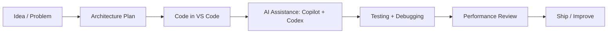

<h1 align="center">Hi 👋, I'm Matthew</h1>

<p align="center">
  
</p>

---

## 🚀 About Me

```txt
🎓 Student
💻 Full-stack developer in progress
📊 Building a DeepCharts-style order flow trading terminal
🤖 Interested in AI-assisted coding, trading models, and system architecture
⚡ Main focus: performance, diagnostics, clean UI, and real-time data
```

---

## 🧠 Current Workflow



---

## 🛠️ Tech Stack

<p align="center">
  
</p>

---

## ⚙️ Tools I Use

<p align="center">
  
  
  
  
  
</p>

---

## 📊 GitHub Statistics

<p align="center">
  
  
</p>

<p align="center">
  
</p>

---

## 📈 Development Activity

<p align="center">
  
</p>

---

## 🔥 What I’m Building

```txt
📊 Order Flow Trading Terminal
├── Python backend
├── React / TypeScript frontend
├── Canvas-based heatmap rendering
├── Real-time order book depth
├── Trade execution overlays
├── Paper trading tools
├── Diagnostics and stale-data checks
└── Future ML / LSTM integration
```

---

## 🧩 Focus Areas

<p align="center">
  
  
  
  
  
</p>

---

## 🧠 Motto

<p align="center">
  
</p>
